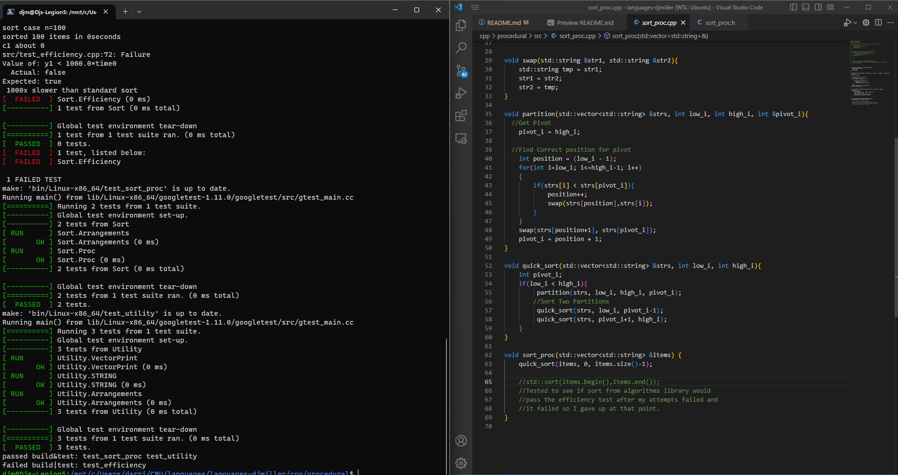
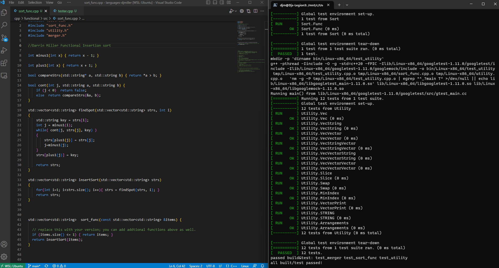
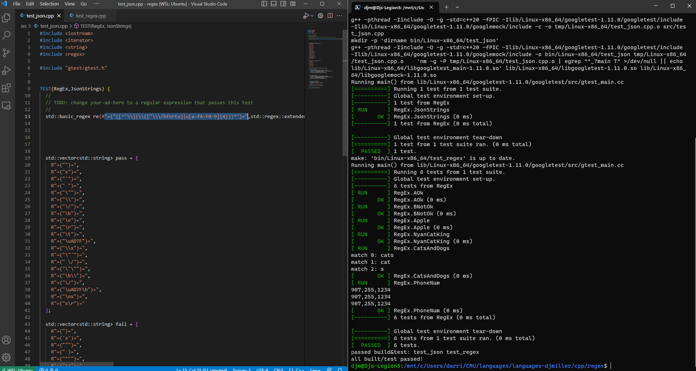
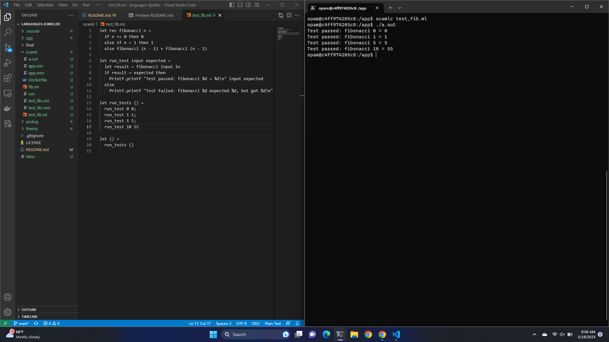
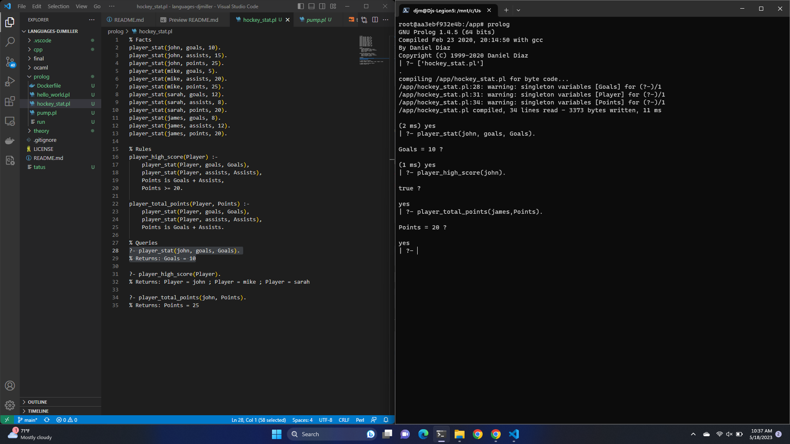

# languages-djmiller
Repo for CMU CSCI-330 Programming Languages with Prof. Macevoy

## Assignments
| Name | Value |
|:---|:---|
| Assignment | Procedural |
| Description | C++ implementation of a Procedural QuickSort |
| Status | Done |
| Location | https://github.com/DJM-Miller/languages-djmiller/tree/main/cpp/procedural |
| Screenshot|  |
|:---|:---|
| Assignment | Functional |
| Description | C++ implementation of a Functional Insertion Sort |
| Status | Done |
| Location | https://github.com/DJM-Miller/languages-djmiller/tree/main/cpp/functional |
| Screenshot|  |
|:---|:---|
| Assignment | Regex |
| Description | Regular expression to validate a json string |
| Status | Done |
| Location | https://github.com/DJM-Miller/languages-djmiller/tree/main/cpp/regex |
| Screenshot|  |
|:---|:---|
| Assignment | OCAML |
| Description | Created a recursive function with unit test |
| Status | Done |
| Location | https://github.com/DJM-Miller/languages-djmiller/tree/main/ocaml |
| Screenshot|  |
|:---|:---|
| Assignment | Prolog |
| Description | created a prolog database a some queries |
| Status | Done |
| Location | https://github.com/DJM-Miller/languages-djmiller/tree/main/prolog |
| Screenshot|  |